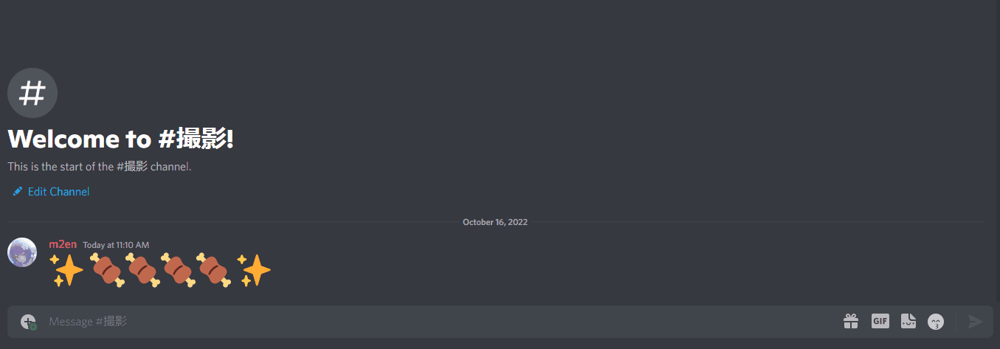

# Introduction

Welcome to the citation guide.

The guide explains how to set up citation and how to customize it.

## What is citation?

citation is a Discord Bot that displays previews of Discord message links.

There is a previous bot developed in TypeScript called [MessageQuote](https://github.com/m2en/MessageQuote). citation solves the problems of that bot and makes it easier to handle.

## What is [Discord](https://discord.com/)?

It is an instant messaging, video calling, voice calling, and VoIP freeware that has been in service since 2015.

A [Discord API](https://discord.com/developers/docs/intro) is available to create Discord applications and other applications, and citaiton works using this Discord API.

## citation features

- When you send a message link, a preview of the message is displayed, so there is no need to jump to the message.
- The preview can be deleted at the touch of a button, so it doesn't interfere with the conversation.
- A channel link is generated at the same time the preview is displayed, so you can jump to the channel.

For more information on the features, please refer to the reference

----

**Come on, let's install citation on your server!**

- [Build citation](install-guide/getting-started.md)
