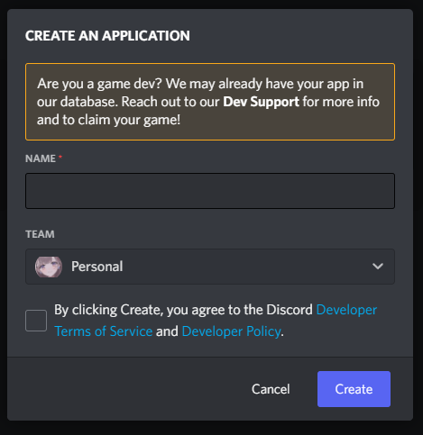
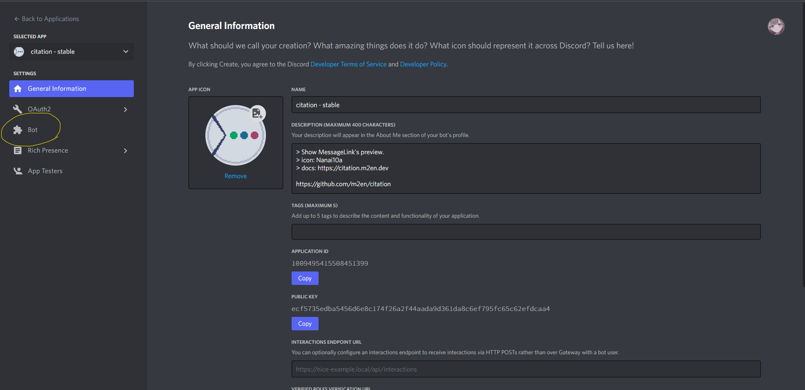
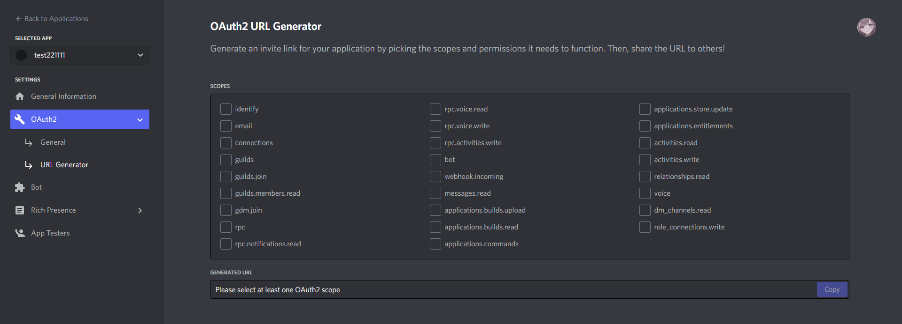
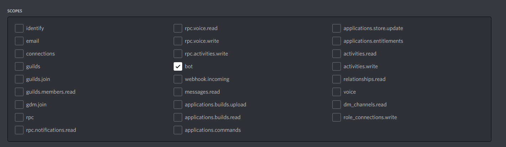

# Creating a Bot

In this guide we will create a Bot that will act as a citation.

## Create an App

Go to [Discord Developer Portal](https://discord.com/developers/applications) and click `New Application`.

After selecting a name and team for your app, click `Create`.

## Create a Bot

After clicking on `App` and navigating to `General Information`, go to the `Bot` menu.

Click `Add Bot` to create a new Bot user.

::: danger If you get Too many users have this username, please try another.

As per the error, the name of the Bot may be covered by another user.

By default, the name of the App is used as the Bot's name, even if the name of the App is the same as another App. (A user account cannot have the same user name and Discord Tag.)

Go back to `General Information`, temporarily change the name of the App and click `Add Bot`.

:::

## Get Token

Click `Reset Token` and copy the Bot's token.

This token will be used to authenticate the Bot. Save it in a safe place as you will use it later.

::: danger Never share your token with others!

The token is confidential information. Never share them with others.

If you want to share your token, please use the team function. Please refer to the Discord Developer Document for more information.

[Teams - Discord Developer Document](https://discord.com/developers/docs/topics/teams)

:::

## Configure Authorization Flow

Configure `Authorization Flow` as needed.

- `PUBLIC BOT`: Set if the bot is a public bot. You can actually create your own public link even if you have not made the invitation link public. If you do not want to make it public, turn this setting OFF. (Even if you turn it off, you can still invite only yourself.)

## Configure Privileged Gateway Intents

Configure `Privileged Gateway Intents` for citation to work properly.

Set `Server Members Intent` and `MESSAGE CONTENT INTENT` to `ON`.

See [here](https://discord.com/developers/docs/topics/gateway#gateway-intents) for more information about `Privileged Gateway Intents`.

## Invite the Bot to the server

Once you have completed the configuration, invite the Bot to join your server.

Go to the `OAuth2 URL Generator` from the `OAuth2` tab.

### Set up `SCOPES

First, configure `SCOPES`.

Since citation is not a web service, just `bot` is fine.

### Setting Permissions

Next, set the bot's permissions.

From `BOT PERMISSIONS`, check the following permissions.

- `Send_Messages` (permission to send messages) - **REQUIRED**.
- `Send_Messages_in_Threads` (permission to send messages in threads) - **REQUIRED**.
- `Embeds_Links` (permission to embed links) - **required**.
- `Attach Files` (permission to send attachments) - **required**.
- `Read Messages / View Channels` (permission to view messages and channels) - **required**.
- `Use External Emojis` (permission to use emojis from another server) - **required** - **required
- `Use External Sticker` (permission to use stickers from another server)

::: tip

Use External Emojis` and `Use External Sticker` are not required, but you should check them if you want to quote emojis and stickers from other sites successfully.

:::

### Invite Bot to your server.

An invitation link will be issued to the `GENERATED URL`. Follow the on-screen instructions to invite the Bot to the server.

----

Thanks for your help. You have now created your Bot.

Please go back to the guide you were in before and move on to the activation process.

- [Build citation with Docker](docker.md)
- [Build it yourself](self-build.md)
