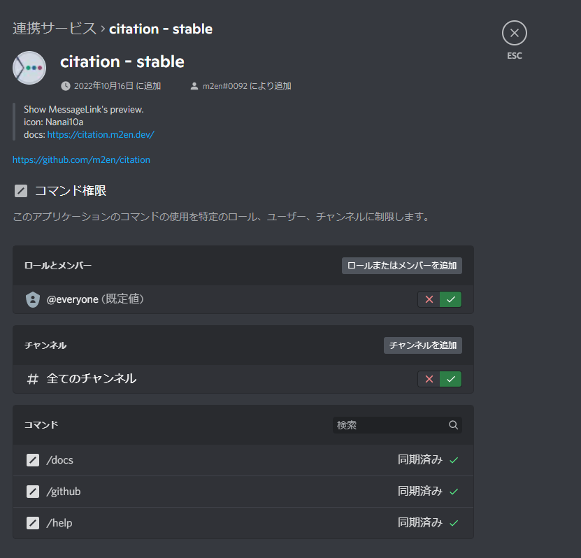

# Command Settings

::: danger Command Permission updates

11/19/2022, the Discord Bot & API team announced on update to the permission setting for Application Command.

The information in this reference may be out of date as the permission settings will be changed from time to time starting on 12/06/2022. (Please check [Discord Developers](https://discord.gg/discord-developers) for the latest information.)

Current citation builds are not affected, but if you have registered your own commands by specifying the `PUT /applications/<application_id>/guilds/<guild_id>/commands/<command_id>/permissions` endpoint If you have registered your own commands, you need to take action.

Please check the Change Log for details.

https://discord.com/developers/docs/change-log#upcoming-application-command-permission-changes

:::

citation's Application Command can be assigned permissions using Discord's Command Permission v2, clearly separating members who can and cannot use it within the community.

## Command Structure

In conventional message-based commands, it is common to take measures such as revoking viewing privileges within the channel.

Commands using the Interaction API employed by citation can be configured in a batch from the guild's linked services' menu, and permissions can be assigned to each command.

## Setting commands

Commands are automatically configured when citation is started. Once the configuration is complete, you can configure the commands from the **Connected Services** menu in the server settings.

::: tip

You can open the linking service by following the steps below.

`Server Menu > Server Settings > Federated Services > Bots and Apps > citation (depending on the name of the App). `

::: 

::: warning Members not restricted by commands

As an exception, members who own guilds are basically unaffected by this permission setting and can use it even with restrictions. (Same as channel and role permissions)

:::

### Setting per role and per member

You can configure per role and per member from the `Roles and Members` sector. **If you select a role, all members with that role will not be able to use any commands. **

Remember that `@everyone` is the default value, so setting `@everyone` will affect everyone regardless of role, but if you set it separately for a role, the role setting will take precedence.

### Setting per channel

The `Channel` sector allows you to set per-channel settings. **If you select a channel, you will not be able to use any commands on that channel. **

All Channels` is the default value, so setting `All Channels` will disable commands on all channels except those that are set individually.

### Setting per command

You can have per-command settings from the `command` sector. This takes precedence over individual settings for roles, members, channels, etc.

----

Check the Discord Help Center for detailed settings

[Command Permissions - Discord Help Center](https://support.discord.com/hc/en-us/articles/4644915651095)
