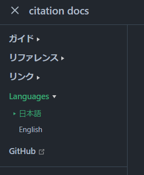

# i18n - multilingual support

citation-dev provides i18n support in **citation** and **citation.m2en.dev**.

## i18n in citation

::: tip

i18n in citation is available from the `v2.3.0` build!

:::

In citation, the language of command description in Application Command is switched according to the language setting of Discord client.

### Supported Languages

- Japanese
- English

### Unsupported languages

- Danish
- German
- British English
- French
- French
- Croatian
- Italian
- Lithuanian
- Hungarian
- Dutch
- Norwegian
- Polish
- Portuguese
- Romanian
- Finnish
- Swedish
- Vietnamese Vietnamese
- Turkish
- Czech
- Greek
- Bulgarian
- Russian
- Ukrainian
- Hindi
- Thai
- Chinese, Taiwanese
- Taiwanese, Chinese
- Korean, Taiwanese

### Configuration Files

i18n consists of property files under `src/main/resources`.

```propertices
help.name=help
help.description=Open to help

ping.name=ping
ping.description=Display response time (Ping)
```

### Add a new language (e.g. Ukrainian)

1. add `DiscordLocale` to `.fromBundles` in `src/main/kotlin/dev/m2en/citation/api/manager/CommandManager.kt`.

```kt
Logger.sendInfo("Start reading location settings ....")
val localizationFunction = ResourceBundleLocalizationFunction
.fromBundles("CitationCommands", DiscordLocale.ENGLISH_US, DiscordLocale.UKRAINIAN)
.build()
Logger.sendInfo("Location settings loaded.")
```

- See JDA's JavaDoc for `DiscordLocale` definition.
  - [Enum DiscordLocale - JDA JavaDoc](https://javadoc.io/doc/net.dv8tion/JDA/latest/net/dv8tion/jda/api/interactions/DiscordLocale.html)

2. add language properties

- Add a language property file with the file name `CitationCommands_<locale>.propertices`.
  - The `locale` can be found by jumping to the `DiscordLocale` definition.
- **Add translations for all commands**.
  - Incomplete translations will not be merged into the `main` branch.
- Check ["configuration file"](#configuration file) for how to write.

## i18n in citation.m2en.dev

This site citation docs (citation.m2en.dev) supports i18n in Japanese and English.

No translation other than English is planned.

### Switching languages

You can change the language from the navigation bar of this site.

::: details PC site

It is located at the top of the site.


:::

::: details Mobile site

Located at the top of the sidebar.



:::

### Translation.

All English pages are maintained in `src/en`.

To translate or correct the grammar, edit these files and send a pull request.

We are also happy to [submit an Issue](https://github.com/citation-dev/citation.m2en.dev/issues/new/choose). Thank you in advance.
