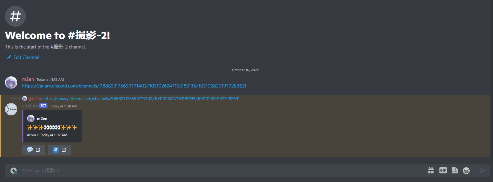
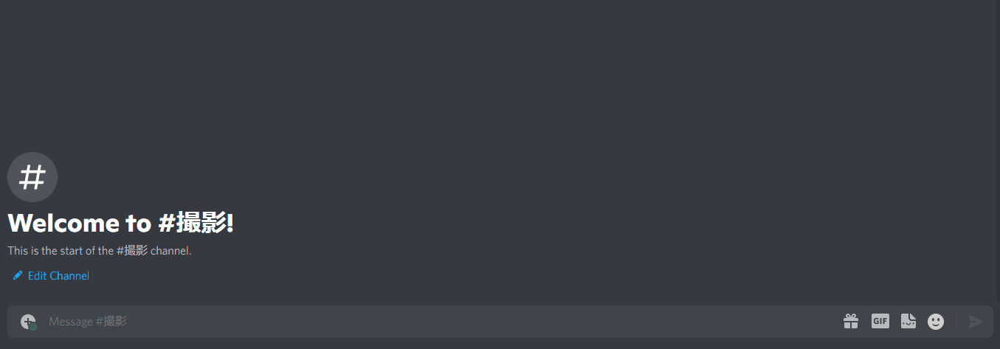
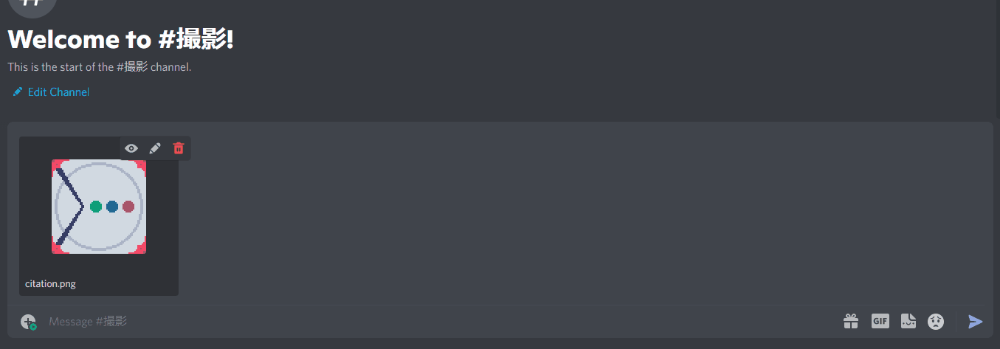

# citation

- Send a message link to a channel to which the citation has read permission to quote.
- If the citation does not have read or speak permissions on the channel you are quoting, you cannot quote it.

::: tip

The following domains are supported by citation.

- `discord.com`.
- `discordapp.com`.
- `canary.discord.com`
- `canary.discordapp.com`
- `ptb.discord.com`
- `ptb.discordapp.com`

:::

## skip citation.

- If you enclose a message link with `<>`, the quote will not be expanded.
- The `<>` will not appear on Discord either.

## remove quote

- You can delete a quote with the `🗑️` button.

::: warning

Only the person who made the quote (the person who sent the message link) can delete a quote.

Users with message management or administrator privileges can also delete quotes.

::::

## Jump to.

- Press the button `💬` to jump to the message.
- You can jump to a channel by pressing the `#️⃣` button.
- You can copy the link from the context menu by right-clicking on the button.

## Quote attachment.

- Video and image attachments can be quoted.
- If only images are quoted, they will appear in Embed.
- If ALT text is set for an attachment, it will be displayed in Embed.
- You can only quote one attachment at a time.

### Spoiler attachments.

- Images with spoiler enabled will not appear in Embed when quoted, only a link will appear.
- You can browse the image from the link.
  - Links to spoiled images are not spoiled. Please be careful when opening them.
- Spoiled attachments are prefixed with `SPOILER.`.

::: tip

For more information about spoilers, please refer to the official help article.

[spoiler tag! - Discord Help Center](https://support.discord.com/hc/en-us/articles/360022320632)

::::

## About NSFW

citation does not cite content from NSFW channels to avoid violating the terms of the agreement.

Channels that will be treated as NSFW channels are as follows

- Text Channels
- Text Chat In Voice Channels (voice chat settings are covered)
- Threads (for the settings of the parent Text Channel)
- Postings (for the parent's Forum channel settings)

## What citation can cite

Content that can be cited by citation is as follows

- Message content
- Attachments (images and videos)
- Code blocks
- Nitro Sticker (stamp)
- Guild Stickers

Citation cannot be cited for the following content

- Ephemeral Message
- System Message
- GIF (Only URL is displayed.)

::: tip What is Ephemeral Message?

Ephemeral messages are messages that are handled by the Interaction API for application commands (slash commands, context menus, etc.).

For details, please refer to the official help article.

[Ephemeral Messages FAQ - Discord Help Center](https://support.discord.com/hc/en-us/articles/1500000580222)

::::

:::: warning About the behavior of some stickers

Some stickers do not return the URL of the image from Discord API (returned in JSON format), so the citation cannot be quoted.

::::
