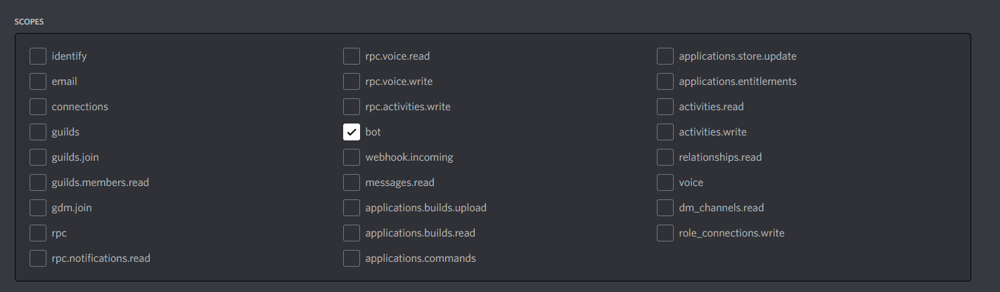

# Botを作成する

このガイドではcitationとして動作するBotを作成します。

## Appを作成する

[Discord Developer Portal](https://discord.com/developers/applications)にアクセスし、`New Application`をクリックします。

アプリの名前とチームを選択したら `Create` をクリックします。

## Botを作成する

Appをクリックして、`General Information` に移動したら、 `Bot` メニューへ移動します。

`Add Bot` をクリックし、新しいBotユーザーを作成しましょう。

::: danger Too many users have this username, please try another. と表示される場合

エラーの通り、Botの名前が他のユーザーと被っている可能性があります。

初期状態ではAppの名前をそのままBotの名前に使います。Appの名前は別のAppと被っていても存在できますが、Botに関してはユーザーのアカウントと同じ扱いです。(ユーザーアカウントも同じユーザー名とDiscord Tagは存在できない)

`General Information` に戻り、Appの名前を一時的に変更して `Add Bot` をクリックしましょう。

:::

## トークンを入手する

`Reset Token` をクリックし、Botのトークンをコピーします。

このトークンはBotの認証に使用されます。後々使うので、安全な場所に保存しておきましょう。

::: danger トークンは絶対に他人に教えないでください

トークンは機密情報です。絶対に他人に教えないようにしてください。

トークンを共有したい場合はチーム機能などを活用してください。詳しくはDiscord Developer Documentを参照してください。

[Teams - Discord Developer Document](https://discord.com/developers/docs/topics/teams)

:::

## Authorization Flow の設定

必要に応じて `Authorization Flow` を設定します。

- `PUBLIC BOT`: 公開Botかの設定を行います。招待リンクを公開していなくても実は公開リンクは自作することができます。公開したくない場合はこの設定をOFFにしてください。(OFFにしても自分だけは招待することができます。)

## Privileged Gateway Intents の設定

citationを正常に動作させるため、 `Privileged Gateway Intents` の設定を行います。

`Server Members Intent` と `MESSAGE CONTENT INTENT` を `ON` にしてください。

`Privileged Gateway Intents` については[こちら](https://discord.com/developers/docs/topics/gateway#gateway-intents)を参照してください。

## Botをサーバーに招待する

設定が完了したらBotをサーバーに招待しましょう。

`OAuth2` タブから `OAuth2 URL Generator` に移動します。

### SCOPES を設定

最初に`SCOPES`を設定します。

citationはWebサービスではないため、 `bot` だけで大丈夫です。

### 権限を設定する

次にBotの権限を設定します。

`BOT PERMISSIONS`から次の権限にチェックをつけてください。

- `Send_Messages` (メッセージの送信権限) - **必須**
- `Send_Messages_in_Threads` (スレッドでのメッセージ送信権限) - **必須**
- `Embeds_Links` (リンクの埋め込み権限) - **必須**
- `Attach Files` (添付ファイル送信権限) - **必須**
- `Read Messages / View Channels` (メッセージ、チャンネルの閲覧権限) - **必須**
- `Use External Emojis` (別鯖の絵文字使用権限)
- `Use External Sticker` (別鯖のステッカー使用権限)

::: tip

`Use External Emojis` と `Use External Sticker` は必須ではありませんが、別鯖の絵文字やステッカーを正常に引用したい場合はチェックをつけてください。

:::

### Botをサーバーに招待する

`GENERATED URL` に招待リンクが発行されます。画面の指示に従ってBotをサーバーに招待してください。

----

お疲れ様です。これでBotを作成することができました。

前にいたガイドに戻って起動作業に移ってください。

- [Dockerでcitationを構築する](docker.md)
- [自分でビルドする](self-build.md)
