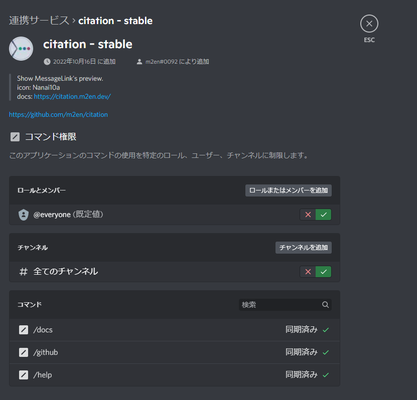

# コマンドの設定

::: danger Command Permission のアップデートについて

2022/11/19 に Discord Bot & API チームにより、Application Command の権限設定に関するアップデートがアナウンスされました。

2022/12/06 から随時権限設定に変更が入るため、このリファレンスに書かれている情報が古くなる場合があります。(最新情報は [Discord Developers](https://discord.gg/discord-developers) にて確認してください。)

現行の citation のビルドには影響がありませんが、 `PUT /applications/<application_id>/guilds/<guild_id>/commands/<command_id>/permissions` のエンドポイントを指定して自分でコマンドを登録している場合は対応が必要です。

詳しくは[Change Log](https://discord.com/developers/docs/change-log#upcoming-application-command-permission-changes)を確認してください。

:::

citation の Application Command は Discord の Command Permission v2 を使って権限を割り当てることができ、コミュニティ内で使えるメンバーと使えないメンバーを明確に分けることができます。

## コマンドの仕組み

従来のメッセージ方式によるコマンドでは、そのチャンネル内の閲覧権限を剥奪するなどして対策するのが一般的でした。

citation が採用している Interaction API を利用したコマンドでは、ギルド内 連携サービスメニュー内から一括でコマンドの設定を行えることができ、コマンド毎に権限を割り当てることもできます。

## コマンドを設定する

コマンドは citation を起動したときに自動で設定されます。設定が完了したらサーバー設定の **連携サービス** からコマンドの設定を行うことができます。

::: tip

連携サービスは次の手順で開くことができます。

`サーバーメニュー > サーバー設定 > 連携サービス > Bots および アプリ > citation (Appの名前によって異なります。)`

:::

::: warning コマンドの制限を受けないメンバー

例外として、ギルドを所有するメンバーは基本的にこの権限設定の影響を受けず、制限をしても使用することができます。(チャンネルやロールの権限と同じ)

:::

### ロールとメンバー毎に設定する

`ロールとメンバー` セクターからロールとメンバー毎に設定することができます。**ロールを選択するとそのロールを持つメンバー全員一切コマンドを使うことができなくなります。**

`@everyone` は既定値となるため、`@everyone` に設定を行うとロール関係なく全員に影響がありますが、ロールで別に設定している場合、ロールの設定が優先されることを覚えといてください。

### チャンネル毎に設定する

`チャンネル` セクターからチャンネル毎に設定することができます。**チャンネルを選択するとそのチャンネルでは一切コマンドを使うことができなくなります。**

`全てのチャンネル` は既定値となるため、`全てのチャンネル` に設定を行うと個別に設定しているチャンネルを除く全てのチャンネルでコマンドが使用できなくなります。

### コマンド毎に設定する

`コマンド` セクターからコマンド毎に設定していることができます。これは、ロールやメンバー、チャンネルなど個別で設定したものよりも優先されます。

---

詳しい設定方法は Discord ヘルプセンターを確認してください

[Command Permissions - Discord ヘルプセンター](https://support.discord.com/hc/ja/articles/4644915651095)
