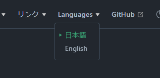
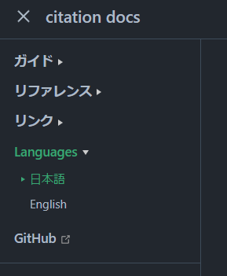

# i18n - 多言語対応

citation-devでは **citation**, **citation.m2en.dev** にてi18n対応を行っています。

## i18n in citation

::: tip 

citationのi18nは `v2.3.0` ビルドから利用できます

:::

citationではDiscord クライアントの言語設定によってApplication Commandのコマンド説明の言語が切り替わります。

### 対応言語

- 日本語
- 英語

### 未対応言語

- デンマーク語
- ドイツ語
- イギリス英語
- スペイン語
- フランス語
- クロアチア語
- イタリア語
- リトアニア語
- ハンガリー語
- オランダ語
- ノルウェー語
- ポーランド語
- ポルトガル語
- ルーマニア語
- フィンランド語
- スウェーデン語
- ベトナム語
- トルコ語
- チェコ語
- ギリシャ語
- ブルガリア語
- ロシア語
- ウクライナ語
- ヒンディー語
- タイ語
- 中国語
- 台湾, 中国語
- 韓国語

### 設定ファイル

i18nは `src/main/resources` 配下にあるプロパティファイルで構成されています。

```propertices
help.name=help
help.description=Open to help

ping.name=ping
ping.description=Display response time (Ping)
```

- `<command>.name` でコマンド名を定義
- `<command>.description` でコマンド説明を定義
  - `<command>.<option>.name` でオプション名を定義
  - `<command>.<option>.description` でオプション説明を定義
- `=` で対になるように定義され、 `"`では囲わない

### 新規言語の追加 (例: ウクライナ語)

1. `src/main/kotlin/dev/m2en/citation/api/manager/CommandManager.kt` の `.fromBundles` に `DiscordLocale` を追加する

```kt
Logger.sendInfo("ロケーション設定の読み込みを開始します....")
val localizationFunction = ResourceBundleLocalizationFunction
    .fromBundles("CitationCommands", DiscordLocale.ENGLISH_US, DiscordLocale.UKRAINIAN)
    .build()
Logger.sendInfo("ロケーション設定を読み込みました。")
```

- `DiscordLocale` の定義はJDAのJavaDocを参照してください。
  - [Enum DiscordLocale - JDA JavaDoc](https://javadoc.io/doc/net.dv8tion/JDA/latest/net/dv8tion/jda/api/interactions/DiscordLocale.html)

2. 言語プロパティを追加する

- 言語プロパティファイルは `CitationCommands_<locale>.propertices` というファイル名で追加します。
  - `locale` は `DiscordLocale` の定義にジャンプすることで確認できます。
- **全てのコマンドの翻訳を追加してください**。
  - 不備がある場合は `main` ブランチにマージできません。
- 書き方は ["設定ファイル"](#設定ファイル) を確認してください。

## i18n in citation.m2en.dev

本サイト citation docs (citation.m2en.dev) では日本語・英語間のi18nに対応しています。

英語以外の翻訳は予定していません。

### 言語の切り替え

言語の切り替えは本サイトのナビバーから変更できます。

::: details PCサイト

サイト上部にあります。



:::

::: details モバイルサイト

サイドバー上部にあります。



### 翻訳する

英語のページはすべて `src/en` で管理されています。

翻訳または文法の修正はこれらのファイルを編集してプルリクエストを送ってください。

[Issueを提出](https://github.com/citation-dev/citation.m2en.dev/issues/new/choose) していただくだけでも嬉しいです。よろしくお願いします。

