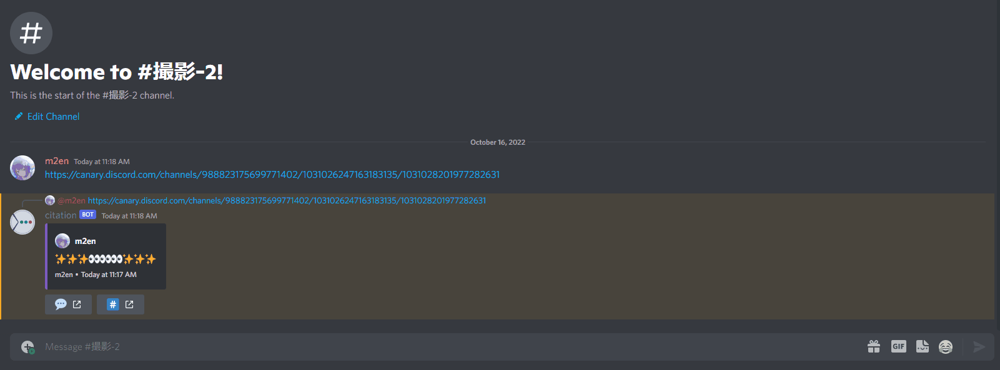
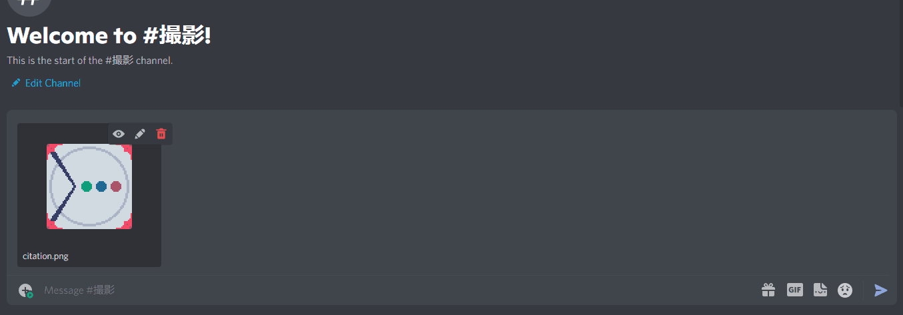

# 引用

## 引用する

- 引用するには citation が閲覧権限を持つチャンネルのメッセージリンクを送信します。
- 引用するチャンネルに citation が閲覧権限または発言権限がない場合は引用できません。

::: tip

citation が対応しているドメインは以下のとおりです。

- `discord.com`
- `discordapp.com`
- `canary.discord.com`
- `canary.discordapp.com`
- `ptb.discord.com`
- `ptb.discordapp.com`

:::

## 引用をスキップする

- メッセージリンクを `<>` で囲むと引用は展開されません。
- `<>` は Discord 上にも表示されることはありません。

## 引用を削除する

- `🗑️` のボタンで引用を削除することができます。

::: warning

引用を削除できる人はその引用を行った人(メッセージリンクを送信した人)のみです。

また、メッセージ管理権限または管理者権限を持つユーザーも削除することができます。

:::

## ジャンプする

- `💬` のボタンを押すとメッセージへジャンプすることができます。
- `#️⃣` のボタンを押すとチャンネルへジャンプすることができます。
- ボタンを右クリックし、コンテキストメニューからリンクをコピーすることができます。

## 添付ファイルを引用する

- 映像、画像の添付ファイルは引用することができます。
- 画像のみ引用すると Embed に表示されます。
- ALT テキストが添付ファイルに設定されている場合は Embed に表示されます。
- 一度に引用できる添付ファイルは一個までです。

### スポイラーの添付ファイル

- スポイラーが有効になった画像は引用しても Embed に表示されず、リンクのみが表示されます。
- リンクから画像を閲覧できます。
  - スポイラーされた画像のリンク先はスポイラー処理されていません。開く際は十分に注意してください。
- スポイラーされた添付ファイルはファイル名の先頭に `SPOILER.` とつきます。

::: tip

スポイラーについては公式ヘルプ記事を御覧ください。

[スポイラータグ！ - Discord ヘルプセンター](https://support.discord.com/hc/ja/articles/360022320632)

:::

## NSFW について

citation は NSFW チャンネルのコンテンツは規約違反を回避するため、引用しません。

NSFW チャンネルとして扱われるチャンネルは以下の通りです。

- テキストチャンネル
- Text Chat In Voice Channels (ボイスチャットの設定が対象になります。)
- スレッド (親元のテキストチャンネルの設定が対象になります。)
- 投稿 (親元のフォーラムチャンネルの設定が対象になります。)

## citation が引用できるもの

citation が引用できるコンテンツは以下のとおりです。

- メッセージ内容
- 添付ファイル (画像・映像)
- コードブロック
- Nitro Sticker (スタンプ)
- Guild Sticker (ギルドスタンプ)

以下のコンテンツは citation が引用できません。

- Ephemeral Message
- システムメッセージ
- GIF (URL のみが表示されます。)

::: tip Ephemeral Message とは

アプリケーションコマンド (スラッシュコマンド・コンテキストメニューなど) の Interaction API で扱われるメッセージ形態です。

詳しくは公式ヘルプ記事を御覧ください。

[Ephemeral Messages FAQ - Discord ヘルプセンター](https://support.discord.com/hc/ja/articles/1500000580222)

:::

::: warning 一部のステッカーの挙動について

ステッカーの種類によっては Discord API から画像の URL が帰ってこない(JSON 方式で返ってくる)ため、citation が引用できません。

:::
