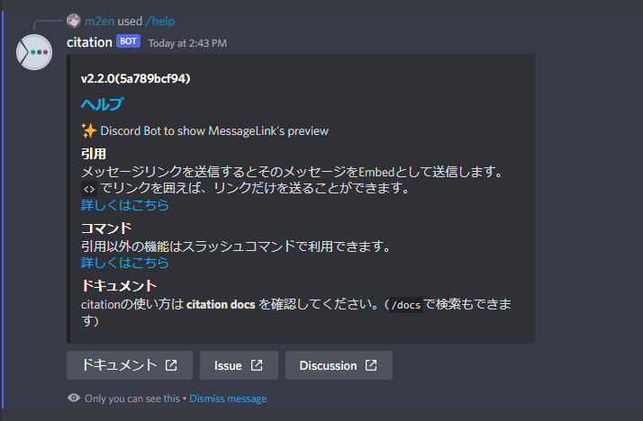

# ヘルプ

`/help` で citation のヘルプを表示します。

---

### バージョン

埋め込みの上部には現在動いている citaiton のバージョンの最新 Git ハッシュが表示されます。

### ヘルプ

`ヘルプ` タイトルをクリックするとリポジトリに移動します。

### ドキュメントボタン

`ドキュメント` ボタンをクリックすると citation docs に移動します。

### Issue

`Issue` ボタンをクリックすると GitHub の Issues に移動します。

### Discussion

`Discussion` ボタンをクリックすると GitHub の Discussions に移動します。

::: tip

埋め込みのリンク・ボタンを右クリックすると URL をコピーすることができます。

:::
